name: title-slide
class: center, middle

# Prepare to Share: Organizing Your Research Data
## With

## [databrary.org](http://databrary.org)

### [Rick O. Gilmore](http://www.personal.psu.edu/rog1)
### 2015-01-23

---

name: agenda-1
class: center

# Agenda

--

### [What is Databrary?](#what-is)

--

### [Video is special](#video-is-special)

--

### [The Challenges of Open (Video) Data Sharing](#challenges)

--

### [Overcoming the Challenges](#overcoming)

--

### [Why You Should Share](#why-share)

--

### [The Future of Open Developmental Science](#future)

---

name: what-is
class: middle, center

# What is Databrary?

---
name: what-is-0
class: middle, center

<a href="http://databrary.org">
    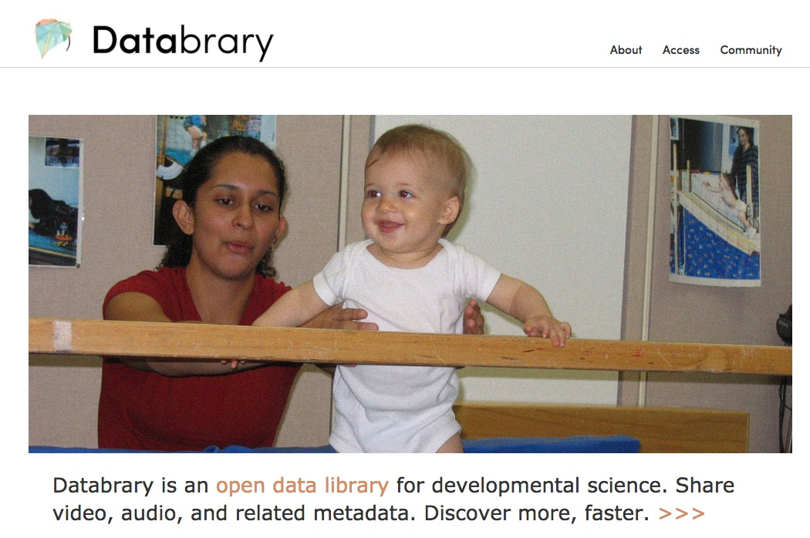
</a>
### <http://databrary.org>

---

name: what-is-1
class: center

# Databrary is a web-based *data library* specialized for storing and sharing 

--

## video

--

## flat-file data

## and metadata

---

name: metadata-is
class: center, middle

<a href="http://26.media.tumblr.com/tumblr_ls8sjtJjOi1qz6f4bo1_500.jpg">
    
</a>
### <http://26.media.tumblr.com/tumblr_ls8sjtJjOi1qz6f4bo1_500.jpg>

---

name: databrary-team
class: center

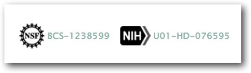

--


#### Karen Adolph & David Millman

--


#### Dylan Simon & Lisa Steiger

---

name: video-is-special
class: middle, center

# Video is special

---

name: video-is-unique
class: center

# Video... 

## uniquely captures the complexity and richness of behavior

--

## can be readily repurposed for new uses with minimal metadata

---

name: funniest-videos
class: center, middle

<iframe width="492" height="277" src="//www.youtube.com/embed/NpLrfGo02aM" frameborder="0" allowfullscreen></iframe>
### <http://www.youtube.com/embed/NpLrfGo02aM">

---

name: repurposing-example-1
class: middle, center
<a href="https://nyu.databrary.org/volume/9">
  
</a>
### <https://databrary.org/volume/9>

---

name: video-needs-tags
class: middle, center

# Repurposing is faster, more efficient with metadata tags
### age, sex, indoor/outdoor, task, etc.

---

name: tagging-tools-academic-1
class: middle, center

# Tools for manual metadata tagging

### [Transana](http://www.transana.org)


### [Elan](http://tla.mpi.nl/tools/tla-tools/elan/)
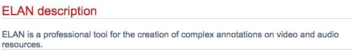

---

name: tagging-tools-commercial-1
class: middle, center

# Tools for manual metadata tagging

### [Noldus Observer](http://www.noldus.com/human-behavior-research/products/the-observer-xt)
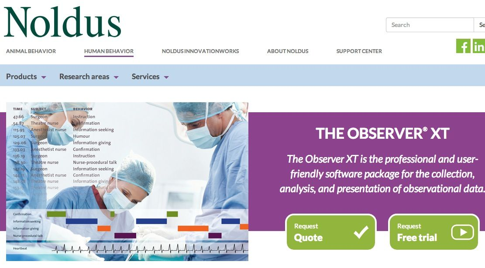

### [Mangold Interact](http://www.mangold-international.com/software/interact/)
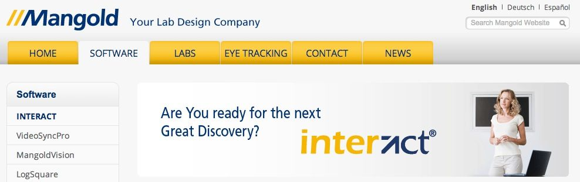

---

name: tagging-tools-commercial-2
class: middle, center

# Tools for manual metadata tagging

### [Studiocode](http://www.studiocodegroup.com)


---

name: tagging-tools-academic-2
class: middle, center

# Tools for manual metadata tagging

### [Datavyu.org](http://datavyu.org/user-guide/guide.html)
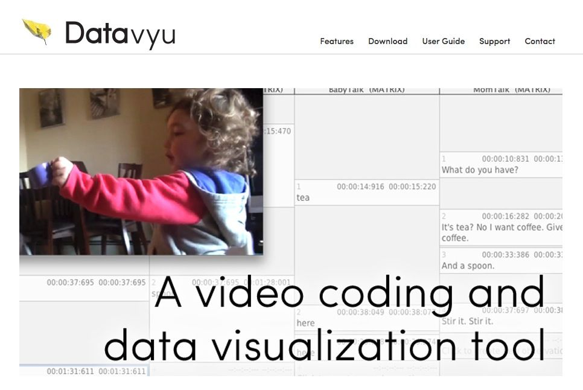

---

name: challenges
class: middle, center

# The Challenges of Open (Video) Data Sharing

---

name: challenges-1
class: middle, center

# Recordings are [identifiable](http://www.research.ucsf.edu/chr/HIPAA/chrHIPAAphi.asp). 
### How to preserve privacy but enable sharing?

---

name: challenges-2
class: middle, center

# Recordings are temporally dense; files are large. 
### How to store?

---

name: challenges-3
class: middle, center

# Data formats differ, may be incompatible
### Mangold vs. Noldus vs. Transana vs. Datavyu vs. Studiocode

---

name: challenges-4
class: middle, center

# Sharing data not part of scientific workflow

---

name: data-sharing-video
class: middle, center

<iframe width="854" height="510" src="//www.youtube.com/embed/N2zK3sAtr-4" frameborder="0" allowfullscreen></iframe>
### <http://www.youtube.com/embed/N2zK3sAtr-4>

---

name: overcoming
class: middle, center

# Overcoming the Challenges

---

name: not-youtube
class: middle, center


--


---

name: preserving-privacy
class: middle, center

# *Recordings are identifiable, so we must...*

---

name: secure-consent
class: middle, center

# Secure *consent to share*
## Build on informed consent, video/photo releases.

---

name: release-template
class: middle, center

<a href="http://databrary.org/access/policies/release-template.html">
    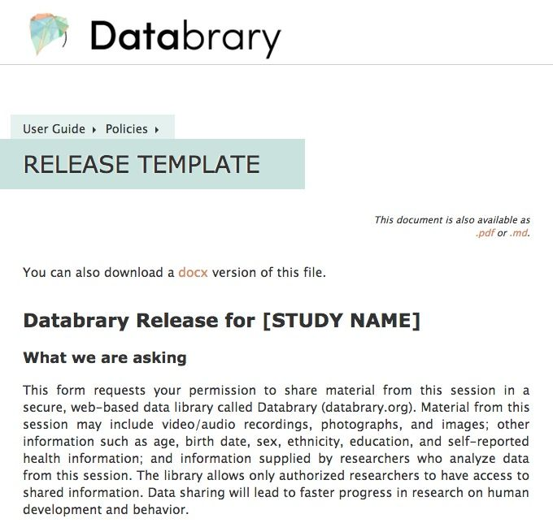
</a>
### <http://databrary.org/access/policies/release-template.html>


---

name: permission-to-share-details
class: middle, center

# *Do you give permission for your identifiable or sensitive information to be shared with* **other researchers**?
### <http://databrary.org/access/policies/release-template.html>

---

name: authorization
class: middle, center

# Qualifications for [authorized researchers](https://nyu.databrary.org/)

<a href="http://databrary.org/access.html">
    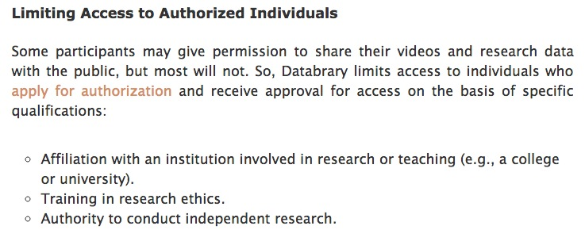
</a>
### <http://databrary.org/access.html>

---

name: three-principles
class: middle, center


## Authorized researchers promise to maintain confidentiality, protect data.
<a href="http://databrary.org/access.html">
    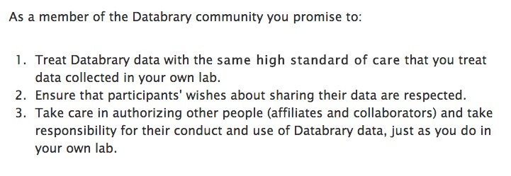
</a>
### <http://databrary.org/access.html>

---

name: institutional-signoff
class: middle, center

## [Institutions must sign-off](https://databrary.org/access.html).
<a href="http://http://databrary.org/access/guide/institutions.html" >
    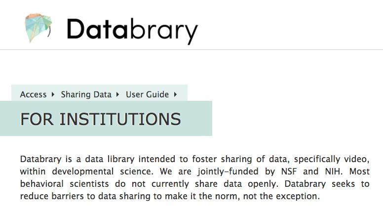
</a>
### <http://http://databrary.org/access/guide/institutions.html>

---
name: individual-autonomy
class: middle, center

# Reinforcing individual autonomy in big-data research

---

name: human-connectome
class: middle, center

<a href="http://humanconnectome.org/" >
    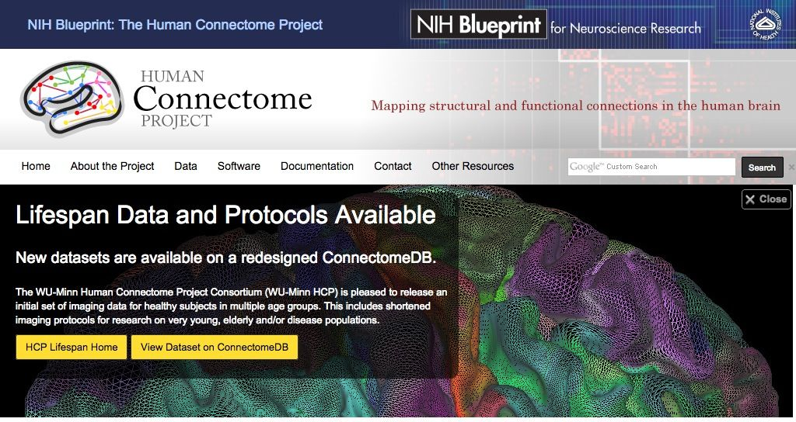
</a>

---

name: open-humans
class: middle, center

<a href="http://http://openhumans.org/">
    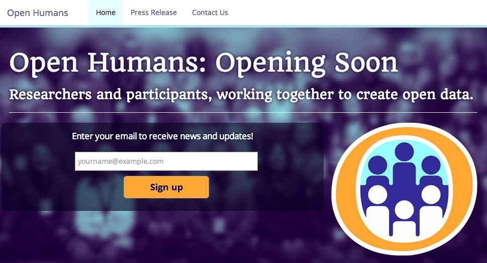
</a>

---

name: personal-genomes
class: middle, center

class: middle, center

<a href="http://www.personalgenomes.org/">
    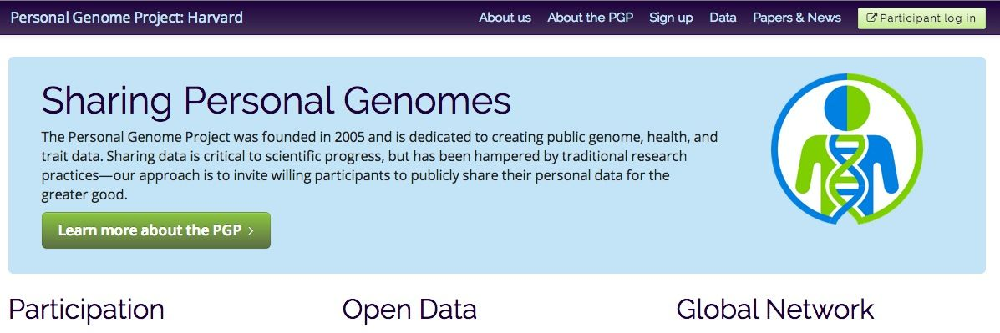
</a>

---

name: files-are-big
class: middle, center

# *Recordings are large and come in varied file formats, so we must...*

---

name: store-centrally
class: middle, center

# Store centrally
# Digitize, convert to standard formats, 
# Convert automatically, not burden researchers.

---

name: incentives
class: middle, center

# There are **few** incentives for data-sharing...
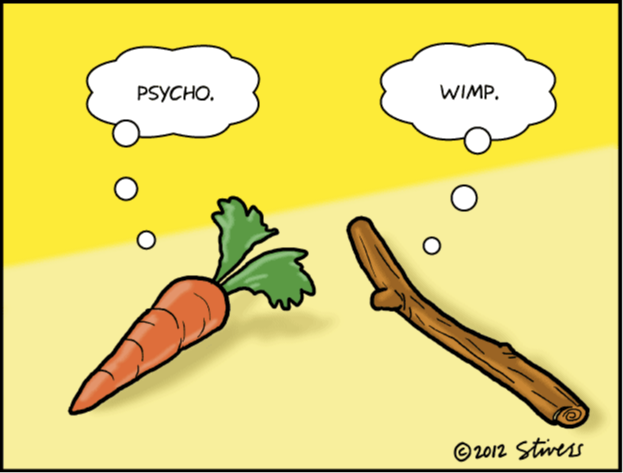
### So, we must

---

name: upload-as-you-go
class: middle, center

# Make data management/curation part of the workflow

--

## Upload as-you-go or active curation

--

### [Open Science Framework (OSF)](http://osf.io)

---

name: upload-demo
class: middle, center

<a href="https://nyu.databrary.org/volume/73">
  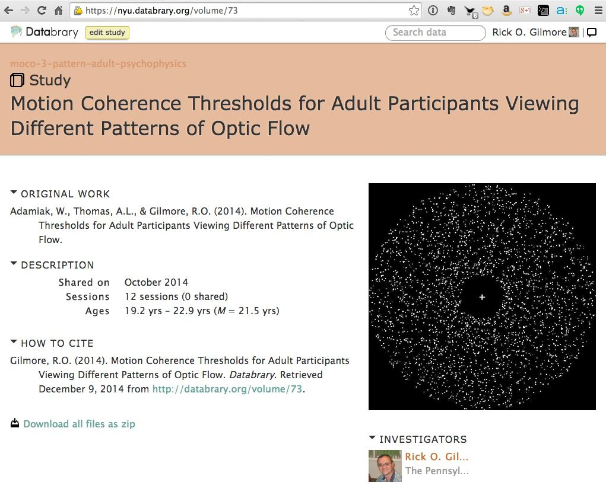
</a>

---

name: manifesto
class: center, middle

# Create positive peer support, not pressure, for sharing
## [Databrary Data Sharing Manifesto](https://databrary.org/access/policies/data-sharing-manifesto.html)

---

name: philosophy
class: center

# Share what you want (and have permission to share)
### Nothing, displays/tasks, flat file data, raw data

--
# Share when you want
### After a grant, after publication, as you go

--

# Share with whom you want
### Lab only, selected colleagues, Databrary community, public

---

name: why-share
class: middle, center

# Why You Should Share

---

name: cool-people
class: middle, center

# Cool people are doing it

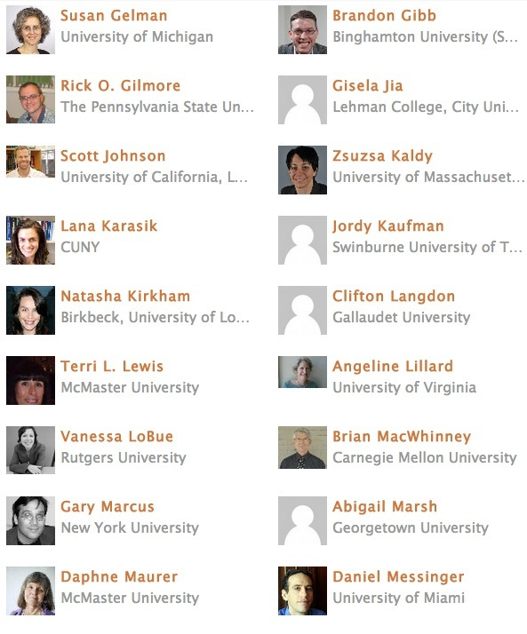
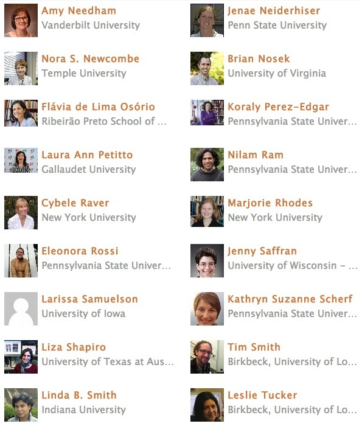

---

name: use-cases
class: middle, center

# There are so many ways to use it

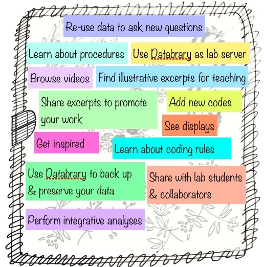

---

name: teaching-use-cases
class: middle, center

# Teaching

## Libertus & Needham et al. 2010
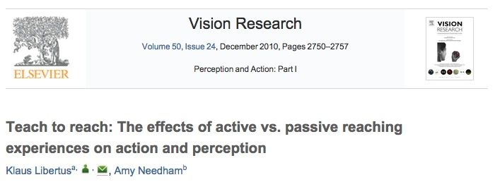

### <https://nyu.databrary.org/volume/64>

---

name: data-model
class: middle, center

# Organize data **your** way, but make it discoverable by others

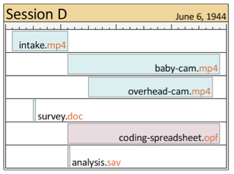

---

name: sessions
class: center

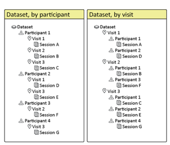
--
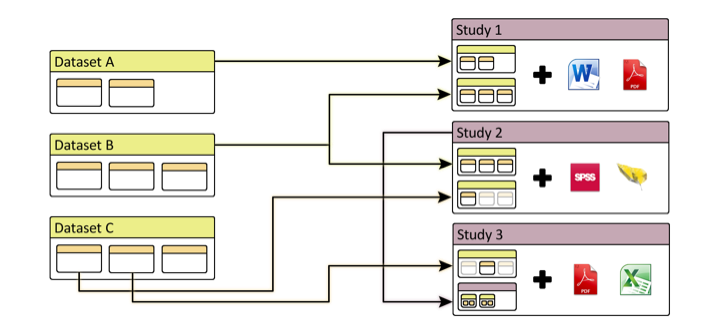

---

name: get-grants
class: middle, center

# Improve chances at funding
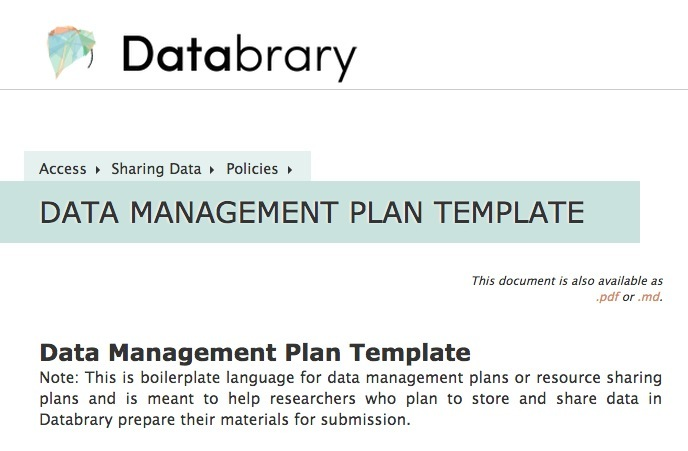
### <http://databrary.org/access/policies/dmp-template.html>

---

name: save-time-money
class: middle, center

# Save time, money

### <http://lowres.jantoo.com/business-desk_job-filing_cabinet-cleaning-cleaners-office_job-16437782_low.jpg>

---

name: lets-prepare-to-share
class: middle, center

# Let's Prepare to Share
## With

## [databrary.org](http://databrary.org)

---

name: next-steps
class: center

# Next steps

### Create an account, apply for authorization

--

### Think about what materials you can share right away

#### Clips for teaching?

--

### Apply for IRB permission to share identifiable data in the future

### Or, ask the IRB whether your current audio/video consent is "Databrary-compatible"

---

name: agenda-1
class: center

# Agenda

--

### [What is Databrary?](#what-is)

--

### [Video is special](#video-is-special)

--

### [The Challenges of Open (Video) Data Sharing](#challenges)

--

### [Overcoming the Challenges](#overcoming)

--

### [Why You Should Share](#why-share)

--

### *[The Future of Open Developmental Science](#future)*

---

name: future
class: center

# The Future of Open Developmental Science

--

## [Web-based video tagging/coding](#datavyu-2.0)

--

## [Seamless data management](#seamless-data-management)

--

## [Getting data in](#data-in)

--

## [Getting data out](#data-out)

--

## [Linking old and new data](#data-linking)

--

## [Deploying richer analyses](#richer-analyses)

---

name: datavyu-2.0
class: center

# The future of video coding/tagging...

--

### Web-based coding

--

### Datavyu 2.0

--

### Integrate/synch multiple streams

--

### Export to preferred analysis formats

--

### Generate code books

---

name: seamless-data-management
class: center

# Research "Consoles"

--

### Keep ongoing record of all research-related work

--

### "Living" documents

--

### Version control

---

name: research-consoles
class: middle, center

### RStudio
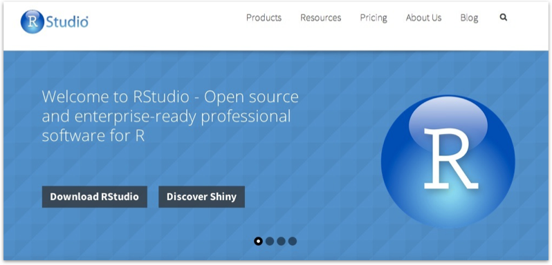

### iPython Notebooks


---

name: research-consoles
class: middle, center

### [Open Science Framework (OSF)](http://osf.io) from the [Center for Open Science (COS)](http://centerforopenscience.org/)
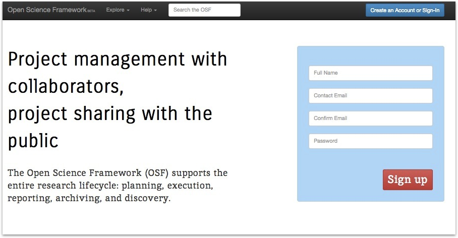


---

name: sharing-references
class: middle, center

# Sharing references

### [Mendeley](http://www.mendeley.com/)
<a href="http://www.mendeley.com/">
  
</a>

### [Zotero](http://zotero.org)
<a href="http://zotero.org">
  
</a>

---

name: data-in
class: center

# Getting data in
### More types of data

--

#### Physiology (EEG, heart rate, GSR)


#### EMA
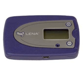

---

name: automated-tagging
class: center

# Getting data in
### Automated tagging


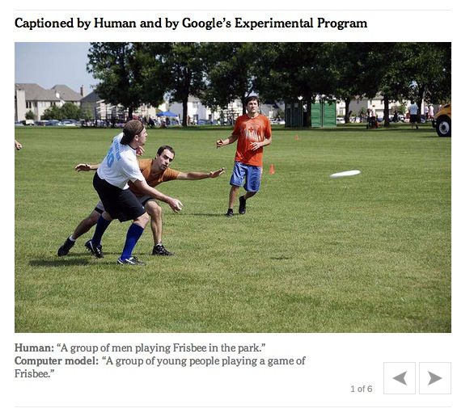

#### <http://www.nytimes.com/2014/11/18/science/researchers-announce-breakthrough-in-content-recognition-software.html?_r=0>

---

name: data-out
class: center

# Getting data out

--

### APIs

--

### Data URIs

```r
df.gilmore.14 <- read.csv("https://databrary.org/volume/73/slot/6490?...")
```

[https://nyu.databrary.org/volume/73/slot/6490?segment=-&select=&asset=13240](https://nyu.databrary.org/volume/73/slot/6490?segment=-&select=&asset=13240)

[Adamiak Thesis Analysis 2014-12-06 in RMarkdown](moco-adult-laminar-radial-summary.html)

---

name: data-linking-2
class: center

# Linking datasets

### Macro
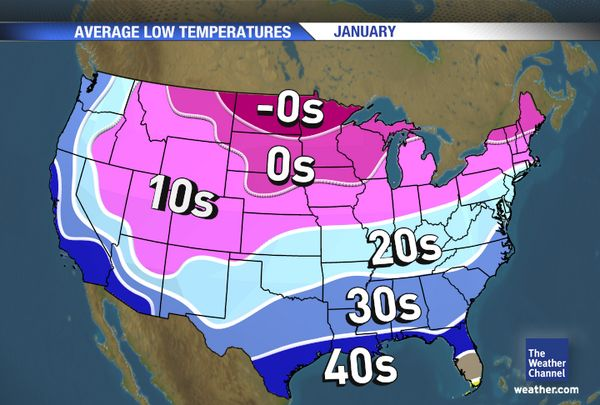

---

name: data-linking-2
class: center

# Linking datasets

### Macro


---

name: data-linking-3
class: center

# Linking datasets

### Micro


---

name: data-linking-4
class: center

# What metadata will facilitate linkage?

--

### How to maintain privacy?

--

### Data provenance?

---

name: richer-analyses
class: middle, center

# Richer analyses

--

## Exploiting temporally rich data

--
## Exploiting spatially diverse (multilevel) data

---

name: data-science
class: middle, center

## Exploiting Advances in Data Science


#### <http://www.datasciencecentral.com/profiles/blogs/data-science-without-statistics-is-possible-even-desirable>

---

name: automatic-statistician
class: center
# [The Automatic Statistician](http://www.automaticstatistician.com/examples.php)

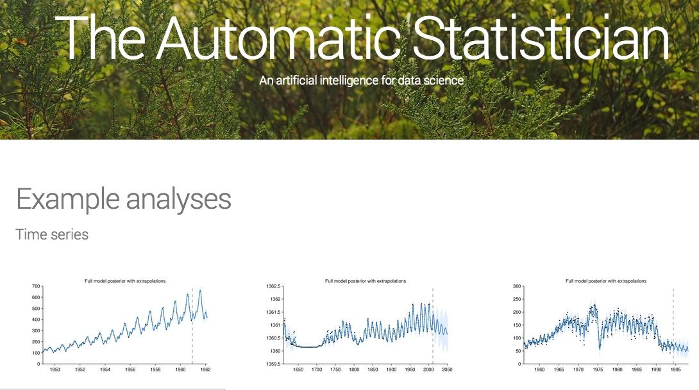

---

name: nsf
class: middle, center

<a href="http://www.nsf.gov/pubs/2015/nsf15523/nsf15523.htm">
  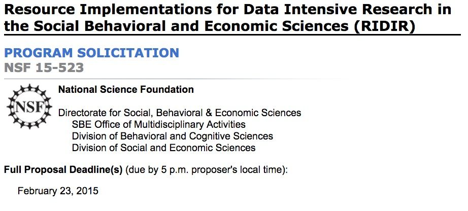
</a>
#### <http://www.nsf.gov/pubs/2015/nsf15523/nsf15523.htm>

