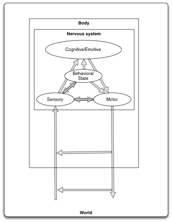
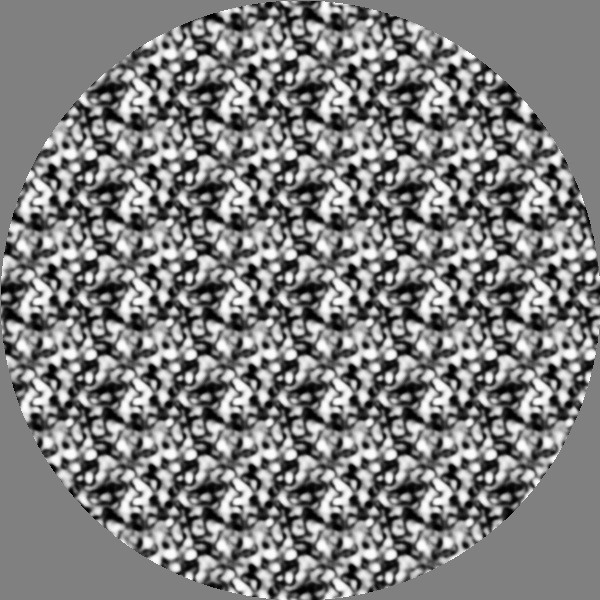
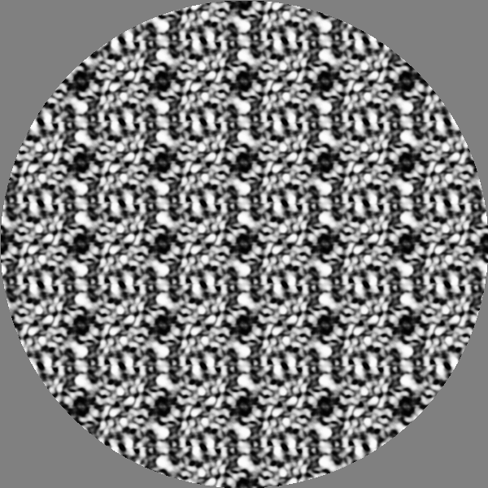
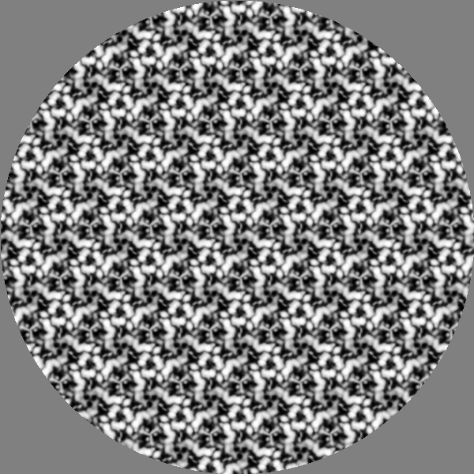
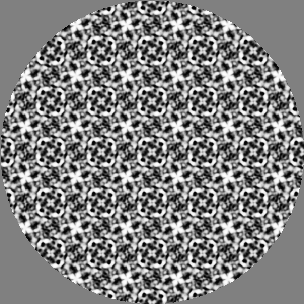
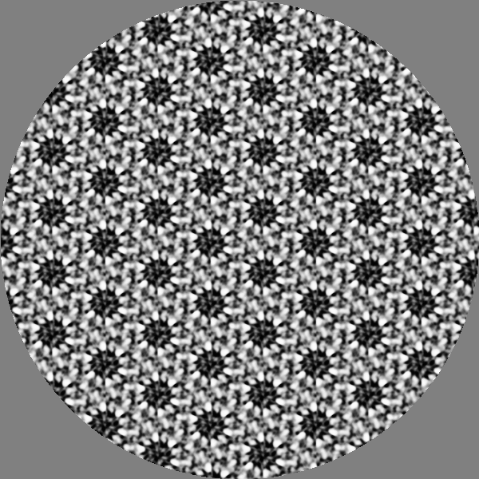
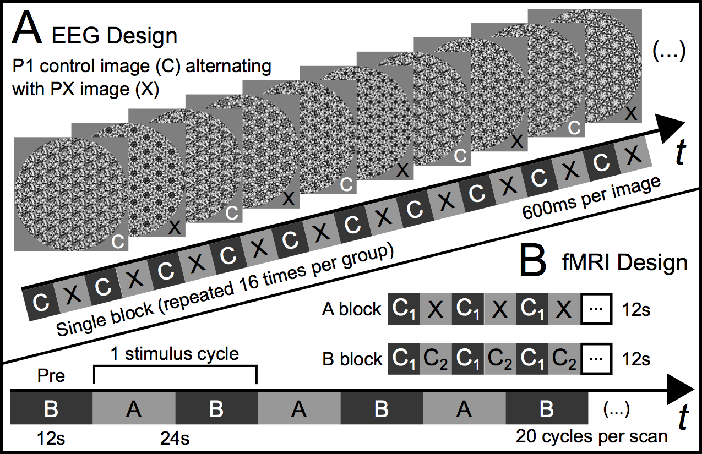
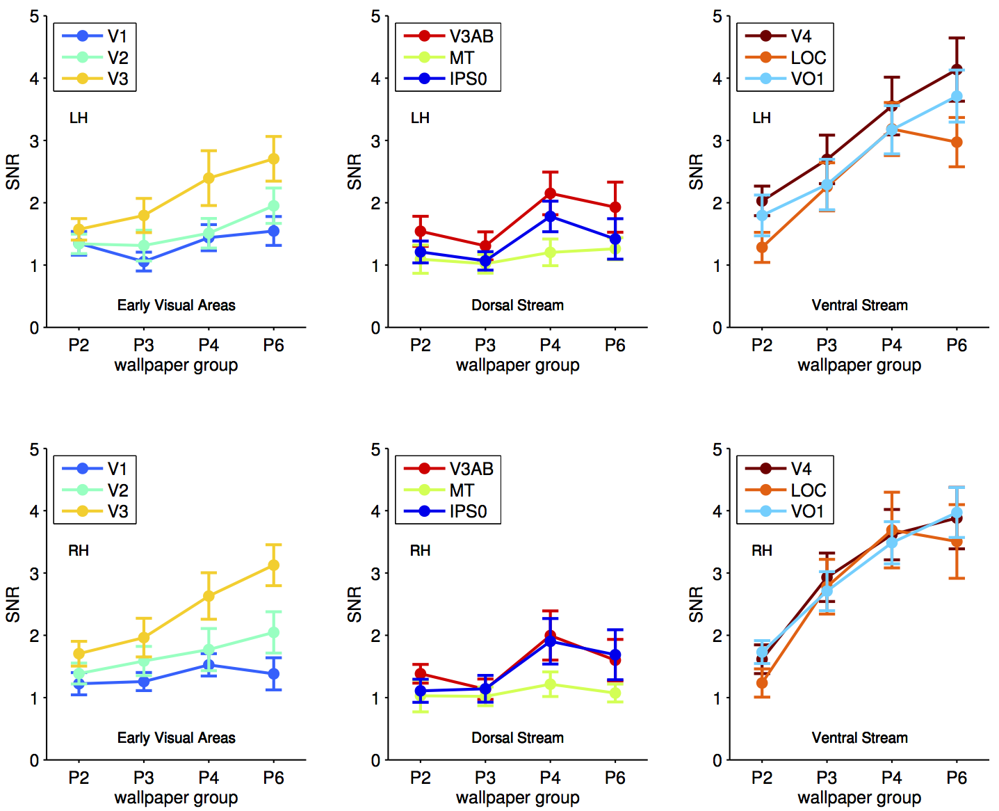
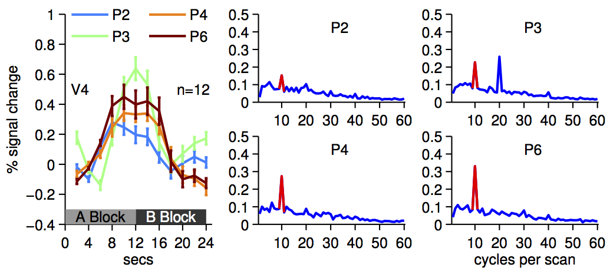
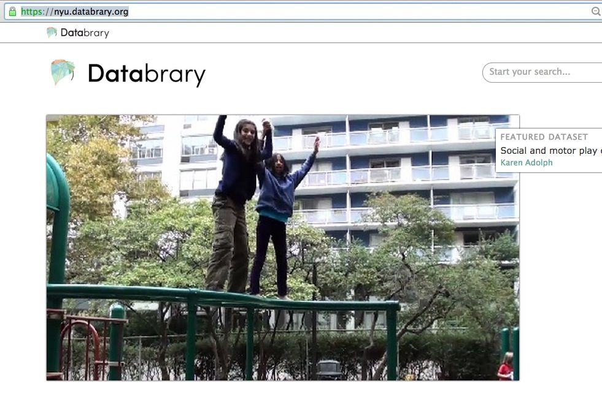

name: title-slide
class: center, middle

# Some Things Computer Scientists Might Find Useful to Know About Human Vision

### [Rick O. Gilmore](http://www.personal.psu.edu/rog1)
#### Department of Psychology
### 2015-02-18

---

name: about-me-work

.left-column[
## About me
### - Work
]

.right-column[
### [Development of perception, action, memory](http://scholar.google.com/scholar?q=hou+gilmore+norcia+2009)
### [Brain development](http://www.wiley.com/WileyCDA/WileyTitle/productCd-0631217363.html)
### [Quantitative/computational models](http://psycnet.apa.org/journals/met/9/1/70/)
### [Natural scene statistics](http://www.mitpressjournals.org/doi/abs/10.1162/NECO_a_00645#.VIhuA2TF_ls)
### [Neuroesthetics](https://github.com/rogilmore/symmetry)
### [Open science, data sharing](http://databrary.org)
]

---

name: about-me-personal

.left-column[
## About me
### - Work
### - Play
]

.right-column[
### Theatre, music
### Cycling, hiking, paddling
### Advocacy
### Poetry
]

---

name: technology-stack
.left-column[
## About me
### - Work
### - Play
### - Stack
]

.right-column[
### JavaScript ([remark.js](http://remarkjs.com/))
### [Markdown](http://daringfireball.net/projects/markdown/)
### CSS, HTML5
### GitHub
#### Source: <https://github.com/gilmore-lab/talks/blob/gh-pages/2015-02-18-cse-class/>
#### Presentation: <http://gilmore-lab.github.io/talks/2015-02-18-cse-class/>
]

---

name: agenda-1

.left-column[
## Agenda
]

.right-column[
### How human vision compares with machine vision

### Studying human symmetry perception from a neural and computational perspective

### Opportunities to apply machine vision to understand human function
]

---

name: human-vision-vs-machine-vision

.left-column[
## Bio vision vs. Machine
]
.right-column[
### Input

### Processing

### Output]

---

name: electromagnetic-spectrum
class: center, middle

*http://www.teachastronomy.com/astropediaimages/2000px-EM_Spectrum_Properties_edit.svg.png*

---

name: visible-spectrum
class: center, middle

*http://physics.ucsd.edu/do-the-math/wp-content/uploads/2012/05/540px-Cone-fundamentals-with-srgb-spectrum.svg_.png*

## *S*hort, *M*edium, and *L*ong wavelength photoreceptors

---

.left-column[ 
## What is vision for?
### - Where is it? 
 ]

.right-column[
- Surface geometry -- position, orientation
- Distance
- Motion, time-to-contact 
]

---

.left-column[ 
## What is vision for?
### - Where is it?
### - What is it?
 ]

.right-column[
- Object detection
- Object identification 
]

---

.left-column[ 
## What is vision for?
### - Where is it?
### - What is it?
### - Why should I care? 
 ]

.right-column[
- Action planning
- Approach/avoid
- Manipulate 
]

---

name: marr

.left-column[
## Worth reading
### - David Marr
]

.right-column[

*http://mitpress.mit.edu/covers/9780262514620.jpg*
]

---

name: gibson

.left-column[
## Worth reading
### - David Marr
### - James J. Gibson
]

.right-column[

*http://ecx.images-amazon.com/images/I/41jADt9D4BL.jpg*
]

---

name: brain-architecture

.left-column[
## Worth reading
### - David Marr
### - James J. Gibson
### - Larry W. Swanson
]
.right-column[

*https://global.oup.com/academic/product/brain-architecture-9780195378580?cc=us&lang=en&*
]

---

name: swanson-brain-architecture

.left-column[
## Worth reading
### - David Marr
### - James J. Gibson
### - Larry W. Swanson
]
.right-column[
]

---

name: plenoptic-function

.left-column[
## Computation
]

.right-column[

*http://web.cs.wpi.edu/~emmanuel/courses/cs563/write_ups/cliffl/images/plenoptic.gif*

### Plenoptic function
### Position (Vx, Vy, Vz), Orientation (&phi;, &theta;), Time (t), Wavelength (&lambda;)
### [Adelson & Bergen 91](https://books.google.com/books?hl=en&lr=&id=5jERNl9fKgEC&oi=fnd&pg=PA3&dq=adelson+bergen+plenoptic+function&ots=LRqf-2Jc7s&sig=31tXO44fAgDJV4DFHMiyvo4PNGA#v=onepage&q=adelson%20bergen%20plenoptic%20function&f=false)
]

---

name: mapping-functions

.left-column[
## Computation
### - Where is it?]

.right-column[
- Egocentric position, motion, geometry of target point X
- Self vs. other motion]

---

.left-column[
## Computation
### - Where is it?
### - What is it?]

.right-column[
- Separable or continuous?
- Moving or static?
- Rigid or non-rigid?
- Animate or inanimate?
- Conspecific (same species) or not?
- Familiar or not?
- Threat or not?
- Kin or not?
- Food or not?
- Mate or not?]

---

.left-column[
## Computation
### - Where is it?
### - What is it?
### - Why should I care?
]
.right-column[
- Move or freeze?
- Approach or avoid?
- Touch, eat, fight, mate with, comfort...
]

---

name: affordances
.left-column[
## Computation
### - Where is it?
### - What is it?
### - Why should I care?
]

.right-column[
### [Affordances](http://en.wikipedia.org/wiki/Affordance)

*http://www.macs-eu.org/images/affordance-animals.jpg*

### Relation between object and organism that specifies possible actions.

#### James. J. Gibson
]

---

name: eye

.left-column[
## The sensor
### - Eye
]

.right-column[

*http://webvision.med.utah.edu/imageswv/Sagschem.jpeg*
]

---

name: retina

.left-column[
## The sensor
### - Eye
### - Retina
]

.left-column[

*http://www.webexhibits.org/causesofcolor/images/content/26z.jpg*
]

---

name: ccd

.left-column[
## The sensor
### - Eye
### - Retina
### - CCD camera
]

.right-column[

*http://www.globalspec.com/ImageRepository/LearnMore/20126/camera-sensor3c3f2bfd16fe46f2aa105a82f6a1c074.png*
]

---

name: eye-vs-camera-1
.left-column[
## The sensor
### - Eye
### - Retina
### - CCD camera
### - [Eye vs. camera](http://petapixel.com/2012/11/17/the-camera-versus-the-human-eye/)
]

.right-column[
<iframe height="600px" width="800" src="https://www.youtube.com/embed/CL61MbyYsd4" frameborder="0" allowfullscreen></iframe>
]

---

name: eye-vs-camera-2

.left-column[
## The sensor
### - Eye
### - Retina
### - CCD camera
### - [Eye vs. camera](http://petapixel.com/2012/11/17/the-camera-versus-the-human-eye/)
] 

.left-column[
## Geometry
- Eye: Spherical
- Camera: Cartesian
]

---

name: eye-vs-camera-2

.left-column[
## The sensor
### - Eye
### - Retina
### - CCD camera
### - [Eye vs. camera](http://petapixel.com/2012/11/17/the-camera-versus-the-human-eye/)
] 

.left-column[
## Geometry
- Eye: Spherical
- Camera: Cartesian

## Temporal sampling
- Eye: [30-100 Hz](http://www.jneurosci.org/content/30/11/3896.full.html)
- Camera: [.67-500 Hz+](http://www.fastecimaging.com/products/handheld-cameras/high-speed-long-record/ts4)
]

---

.left-column[
## The sensor
### - Eye
### - Retina
### - CCD camera
### - [Eye vs. camera](http://petapixel.com/2012/11/17/the-camera-versus-the-human-eye/)
] 

.right-column[
## Image compression
- Eye: 125:1
- Camera: ?

*http://www.webexhibits.org/causesofcolor/images/content/26z.jpg*
]

---

.left-column[
## The sensor
### - Eye
### - Retina
### - CCD camera
### - [Eye vs. camera](http://petapixel.com/2012/11/17/the-camera-versus-the-human-eye/)
] 

.left-column[
## Stereo
- Eye: Separated by ~ 6 cm, both eyes move
- [Camera](http://en.wikipedia.org/wiki/Stereo_camera): usually fixed 
]

---

.left-column[
## The sensor
### - Eye
### - Retina
### - CCD camera
### - [Eye vs. camera](http://petapixel.com/2012/11/17/the-camera-versus-the-human-eye/)
] 

.left-column[
## Stereo
- Eye: Separated by ~ 6 cm, both eyes move
- [Camera](http://en.wikipedia.org/wiki/Stereo_camera): usually fixed 

## Image stabilization
- Eye: nystagmus, saccades, pursuit, vestibulo-occular reflex
- Camera: [optical and digital](http://cameras.about.com/od/technologies/a/image_stabiliza.htm)
]

---

name: human-vision-vs-machine-vision-2

.left-column[
## Bio vision vs. Machine
]
.right-column[
### *Input*

### Processing

### *Output*
]

---

name: from-eye-to-brain

.left-column[
## Processing networks
### - Visual brain
]

.right-column[

*http://vis.berkeley.edu/courses/cs294-10-sp10/wiki/images/6/6b/Felleman_CC_1991.png*

#### [Felleman & Van Essen 91](http://cercor.oxfordjournals.org/content/1/1/1.1.short)
]

---

name: felleman-vanessen-91

.left-column[
## Processing networks
### - Visual brain
]

.right-column[

*http://www.cse.yorku.ca/~billk/images/brainMap.gif*

#### [Felleman & Van Essen 91](http://cercor.oxfordjournals.org/content/1/1/1.1.short)
]

---

name: networks-and-the-brain

.left-column[
## Processing networks
### - Visual brain
### - Rest of brain
]

.right-column[

*http://humanconnectome.org/about/pressroom/wp-content/uploads/2012/03/NIH_Functional-Connectivity-Matrix.png*

#### [Human Connectome Project](http://www.humanconnectomeproject.org/)
]

---

name: retinotopy-1

.left-column[
## Processing networks
### - Visual brain
### - Rest of brain
### - Topographic maps
]

.right-column
[

*http://ars.els-cdn.com/content/image/1-s2.0-S089662730700774X-gr1.jpg*

#### [Wandell et al. 07](http://www.sciencedirect.com/science/article/pii/S089662730700774X)
]

---

name: retinotopy-2

.left-column[
## Processing networks
### - Visual brain
### - Rest of brain
### - Topographic maps
]

.right-column[

*http://ars.els-cdn.com/content/image/1-s2.0-S089662730700774X-gr3.jpg*

#### [Wandell et al. 07](http://www.sciencedirect.com/science/article/pii/S089662730700774X)
]

---

name: retinotopy-3

.left-column[
## Processing networks
### - Visual brain
### - Rest of brain
### - Topographic maps
]

.right-column[

*http://ars.els-cdn.com/content/image/1-s2.0-S089662730700774X-gr2.jpg*

#### [Wandell et al. 07](http://www.sciencedirect.com/science/article/pii/S089662730700774X)
]

---

name: feature-detection

.left-column[
## Processing networks
### - Visual brain
### - Rest of brain
### - Topographic maps
### - What do they compute?
]
.right-column[
### Edges

### Wavelength contrast (color)

### Motion
]
---

name: what-where

.left-column[
## Processing networks
### - Visual brain
### - Rest of brain
### - Topographic maps
### - What do they compute?
### - Specialization
]

.right-column[

*https://lh5.googleusercontent.com/-5fvutO3mGNk/ULPz3gqvMeI/AAAAAAAAk2w/CHpezGpt9mo/w800-h800/ventral-dorsal-stream.png*
]

---

name: mishkin-ungerleider-macko-82

.left-column[
## Two streams
### - Where vs. What]

.right-column[

#### [Mishkin, Ungerleider, Macko 82](http://www.sciencedirect.com/science/article/pii/016622368390190X)]

---

.left-column[
## Two streams
### - Where vs. What
### - *How* vs. What
]
.right-column[

#### [Mishkin, Ungerleider, Macko 82](http://www.sciencedirect.com/science/article/pii/016622368390190X)
#### [Goodale & Milner 92](http://www.sciencedirect.com/science/article/pii/0166223692903448)]

---

.left-column[
## Processing networks
### - Visual brain
### - Rest of brain
### - Topographic maps
### - What do they compute?
### - Specialization
### - Neurocomputing
]
.right-column[
### Brain-inspired face recognition

*https://www.technologyreview.com/sites/default/files/images/Monkey%20patches.png*

#### [Fahrzmadi et al. 2015](http://arxiv.org/abs/1502.01241)]

---

.left-column[
## Processing networks
### - Visual brain
### - Rest of brain
### - Topographic maps
### - What do they compute?
### - Specialization
### - Neurocomputing
]
.right-column[
### Deep learning

<iframe width="800" height="500" src="http://deeplearning.net/" frameborder="0" allowfullscreen>
</iframe>]

---

name: agenda-2

.left-column[# Agenda]

.right-column[
### *How human vision compares with machine vision*

### Studying human symmetry perception from a neural and computational perspective

### *Opportunities to apply machine vision to understand human function*
]

---

.left-column[
## Symmetry detection in brain and behavior]

.right-column[

*https://svndl.stanford.edu/sites/default/files/wade_symmetry_best_blank_1.png*

#### [Wade 1993](http://books.simonandschuster.com/Crystal-and-Dragon/David-Wade/9780892814046)]

---

.left-column[
## Symmetry detection in brain and behavior
### - Facial symmetry
]

.right-column[
## Left/right face nearly, but not perfectly symmetric
## Symmetry influences [perception of attractiveness](http://www.nsmbl.com/what-symmetry-can-do-to-your-face/)

]
---

name: cohen-zaidi-2013

.left-column[
## Behavior
### - [Cohen & Zaidi 13](http://www.journalofvision.org/content/13/6/22.full)
]
.right-column[

*http://www.journalofvision.org/content/13/6/22/F3.medium.gif*

### Task: time to judge vertical or horizontal symmetry
]

---

name: norcia-etal-2002

.left-column[
## Brain responses
- ### [Norcia et al. 02](http://www.journalofvision.org/content/2/2/1.full)
]
.right-column[

*http://www.journalofvision.org/content/2/2/1/F1.medium.gif*

### Steady-state Visually Evoked Potentials (SSVEPs)
### 4-fold reflection symmetry vs. random
]

---

name: norcia-etal-2002-1

.left-column[
## Brain responses
- ### [Norcia et al. 02](http://www.journalofvision.org/content/2/2/1.full)
]
.right-column[

*http://www.journalofvision.org/content/2/2/1/F2.medium.gif*

### EEG response to (mirror) symmetric/random modulation
]

---

name: sasaki-etal-pnas-04
.left-column[
## Brain responses
- ### [Norcia et al. 02](http://www.journalofvision.org/content/2/2/1.full)
- ### [Sasaki et al. 04](http://www.pnas.org/content/102/8/3159.full)
]

.right-column[

*http://www.pnas.org/content/102/8/3159/F1.medium.gif*

### fMRI (blood oxygen) response
### Activation in "what" stream
]

---

name: liu-norcia-gilmore-kohler
class: middle, center

# What about rotational symmetry?

---

name: kohler-etal-2014-p1
class: middle, center

### P1

---

name: kohler-etal-2014-p2
class: middle, center

### P2

---

name: kohler-etal-2014-p3
class: middle, center

### P3

---

name: kohler-etal-2014-p4
class: middle, center

### P4

---

name: kohler-etal-2014-p6
class: middle, center

### P6

---

name: steady-state-design

.left-column[
## Brain responses
### - Kohler et al. 2014
### - Experiment design
]
.right-column[
## Modulate rotational symmetry (P2, P3, P4, P6) vs. non- (P1)
]

---
.left-column[
## Brain responses
### - Kohler et al. 2014
### - Experiment design
]
.right-column[

]

---

name: kohler-etal-2014-p1
class: middle, center

### P1

---

name: kohler-etal-2014-p2
class: middle, center

### P2

---

name: kohler-etal-2014-p1
class: middle, center

### P1

---

name: kohler-etal-2014-p3
class: middle, center

### P3

---

name: kohler-etal-2014-p1
class: middle, center

### P1

---

name: kohler-etal-2014-p4
class: middle, center

### P4

---

name: kohler-etal-2014-p1
class: middle, center

### P1

---

name: kohler-etal-2014-p6
class: middle, center

### P6

---

name: kohler-etal-2014-snr

.left-column[
## Brain responses
### - Kohler et al. 2014
### - Results
]
.right-column[

### fMRI SNR increases with rotational symmetry
]

---

name: kohler-etal-2014-surf

.left-column[
## Brain responses
### - Kohler et al. 2014
### - Results
]
.right-column[

### Higher order "what/form" areas strongest
]

---

name: kohler-etal-2014-surf

.left-column[
## Brain responses
### - Kohler et al. 2014
### - Results
]
.right-column[

### Higher order "what/form" areas strongest
]

---

name: agenda-2

.left-column[# Agenda]

.right-column[
### *How human vision compares with machine vision*

### *Studying human symmetry perception from a neural and computational perspective*

### Opportunities to apply machine vision to understand human function
]

---

name: what-is-databrary

.left-column[

]

.right-column[
## ...is a digital *data library* specialized for storing and sharing 

### video

### flat-file (alphanumeric) data

### and metadata.
]

---

name: databrary-volume-9

.left-column[

## Why video?
]
.right-column[
### Scientists who study behavior collect it.
### More easily re-used than other data.
### Not currently shared widely.
### Privacy, technical, cultural barriers.
]

---

class: center, middle

---

name: video-needs-tags

.left-column[

## Why video?
## Tech challenges
]

.right-column[
### Researchers mostly tag/code videos manually

### Imagine applying machine vision to video tagging
]

---

name: raudies-gilmore-14
.left-column[

## Why video?
## Tech challenges
## Mining research video data
]

.right-column[
<iframe width="800" height="500" src="http://www.mitpressjournals.org/doi/full/10.1162/NECO_a_00645#.VONsoLDF9LA" frameborder="2" allowfullscreen></iframe>

*http://www.mitpressjournals.org/doi/full/10.1162/NECO_a_00645#.VONsoLDF9LA*

#### [Raudies & Gilmore 14](http://www.mitpressjournals.org/doi/full/10.1162/NECO_a_00645#.VONsoLDF9LA)
]

---

name: machine-vision-video-coding
.left-column[

## Why video?
## Tech challenges
## Mining research video data
]

.right-column[
## Active commercial vendors

### [Clarifai](http://www.clarifai.com/)

### [Alchemy](http://www.alchemyapi.com/)

## Career opportunities in *academic/scientific* research, too!
]

---

name: unsolicited-advice

# Unsolicited advice

--

## Learn to code

--

### I mean really

--

## Contribute to open source projects

--

## Learn how to teach yourself new things

--

### And keep learning...

---

name: thanks
class: middle, center

## Thank you!