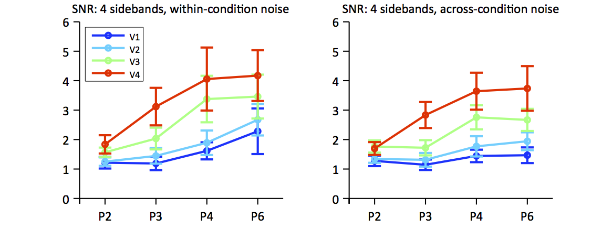

name: title-slide
class: center, middle

# Some Things Computer Scientists Might Find Useful to Know About Human Vision

### [Rick O. Gilmore](http://www.personal.psu.edu/rog1)
### 2015-02-18

---

name: about-me-work
class: center

# Work
### [Development of perception, action, memory](http://scholar.google.com/scholar?q=hou+gilmore+norcia+2009)
### [Brain development](http://www.wiley.com/WileyCDA/WileyTitle/productCd-0631217363.html)
### [Quantitative/computational models](http://psycnet.apa.org/journals/met/9/1/70/)
### [Natural scene statistics](http://www.mitpressjournals.org/doi/abs/10.1162/NECO_a_00645#.VIhuA2TF_ls)
### [Neuroesthetics](https://github.com/rogilmore/symmetry)
### [Open science, data sharing](http://databrary.org)

---

name: about-me-personal
class: center

# [Personal](http://rick-gilmore.org/)
### Theatre, music
### Cycling, hiking, paddling
### [Advocacy](http://rick-gilmore.org)

---

name: technology-stack
class: middle, center

## JavaScript ([remark.js](http://remarkjs.com/))
## [Markdown](http://daringfireball.net/projects/markdown/)
## CSS, HTML5
## GitHub
#### Source: <http://github.com/gilmore-lab/talks/2015-02-18-cse-class/>
#### Presentation: <http://gilmore-lab.github.io/talks/2015-02-18-cse-class/>

---

name: agenda-1
class: center

# Agenda

--

### How human vision compares with machine vision

--

### Studying human symmetry perception from a neural and computational perspective

--

### Opportunities to apply machine vision to understand human function

---

name: human-vision-vs-machine-vision
class: center

# Structure of biological and machine vision systems

## Input

## Processing

## Output

---

name: electromagnetic-spectrum
class: center, middle

*http://www.teachastronomy.com/astropediaimages/2000px-EM_Spectrum_Properties_edit.svg.png*

---

name: visible-spectrum
class: center, middle

*http://physics.ucsd.edu/do-the-math/wp-content/uploads/2012/05/540px-Cone-fundamentals-with-srgb-spectrum.svg_.png*

## *S*hort, *M*edium, and *L*ong wavelength photoreceptors

---

name: what-is-vision-for
class: 

## What is vision for?

--

### Where is it?

- Surface geometry -- position, orientation, distance, motion 

--

### What is it?

- Object detection, identification

--

### Why should I care? What should I do?

- Action planning
- Approach/avoid
- Manipulate

---

name: marr
class: middle, center

*http://mitpress.mit.edu/covers/9780262514620.jpg*

### David Marr

---

name: gibson
class: middle, center

*http://ecx.images-amazon.com/images/I/41jADt9D4BL.jpg*

### James J. Gibson

---

name: brain-architecture
class: middle, center

 

---

name: swanson-brain-architecture
class: middle, center

## Larry W. Swanson

---

name: plenoptic-function
class: middle, center

# Plenoptic function ([Adelson & Bergen](https://books.google.com/books?hl=en&lr=&id=5jERNl9fKgEC&oi=fnd&pg=PA3&dq=adelson+bergen+plenoptic+function&ots=LRqf-2Jc7s&sig=31tXO44fAgDJV4DFHMiyvo4PNGA#v=onepage&q=adelson%20bergen%20plenoptic%20function&f=false))

*http://web.cs.wpi.edu/~emmanuel/courses/cs563/write_ups/cliffl/images/plenoptic.gif*

### Position (Vx, Vy, Vz), Orientation (&phi;, &theta;), Time (t), Wavelength (&lambda;)

---

name: mapping-functions

# Where is it?
- Egocentric position, motion, geometry of target point X
- Self vs. other motion

--

# What is it?

- Separable or continuous?
- Moving or static?
- Rigid or non-rigid?
- Animate or inanimate?
- Conspecific (same species) or not?
- Familiar or not?
- Threat or not?
- Kin or not?
- Food or not?
- Mate or not?

---

name: mapping-functions-2

# Why should I care? What should I do about it?

- Move or freeze?
- Approach or avoid?
- Touch, eat, fight, mate with, comfort...

---

name: affordances
class: center, middle

## [Affordances](http://en.wikipedia.org/wiki/Affordance)

*http://www.macs-eu.org/images/affordance-animals.jpg*

### Relation between object and organism that specifies possible actions.

#### James. J. Gibson

---

name: eye
class: center, middle

*http://webvision.med.utah.edu/imageswv/Sagschem.jpeg*

---

name: retina
class: center, middle

*http://www.webexhibits.org/causesofcolor/images/content/26z.jpg*

---

name: ccd
class: center, middle

---

name: eye-vs-camera-1
class: center, middle

# Vision smack-down, [Eye Vs. Camera](http://petapixel.com/2012/11/17/the-camera-versus-the-human-eye/)

<iframe width="560" height="315" src="https://www.youtube.com/embed/CL61MbyYsd4" frameborder="0" allowfullscreen></iframe>

---

name: eye-vs-camera-2
class: 

## Geometry
- Eye: Spherical
- Camera: Cartesian

--

## Temporal sampling
- Eye: [30-100 Hz](http://www.jneurosci.org/content/30/11/3896.full.html)
- Camera: [.67-500 Hz+](http://www.fastecimaging.com/products/handheld-cameras/high-speed-long-record/ts4)

--

## Image compression
- Eye: 125:1
- Camera: ?

---

class: middle, center

*http://www.webexhibits.org/causesofcolor/images/content/26z.jpg*

---

name: eye-vs-camera-3
class: 

## Stereo
- Eye: Separated by ~ 6 cm, both eyes move
- [Camera](http://en.wikipedia.org/wiki/Stereo_camera): usually fixed  

--

## Image stabilization/detection
- Eye: nystagmus, saccades, pursuit, vestibulo-occular reflex
- Camera: [optical and digital](http://cameras.about.com/od/technologies/a/image_stabiliza.htm)

---

name: human-vision-vs-machine-vision-2
class: center

# Structure of biological and machine vision systems

## *Input*

## Processing

## Output

---

name: from-eye-to-brain
class: middle, center

*http://vis.berkeley.edu/courses/cs294-10-sp10/wiki/images/6/6b/Felleman_CC_1991.png*

#### [Felleman & Van Essen 91](http://cercor.oxfordjournals.org/content/1/1/1.1.short)

---

name: felleman-vanessen-91
class: middle, center

*http://www.cse.yorku.ca/~billk/images/brainMap.gif*

#### [Felleman & Van Essen 91](http://cercor.oxfordjournals.org/content/1/1/1.1.short)

---

name: networks-and-the-brain
class: middle, center

*http://humanconnectome.org/about/pressroom/wp-content/uploads/2012/03/NIH_Functional-Connectivity-Matrix.png*

#### [Human Connectome Project](http://www.humanconnectomeproject.org/)

---

name: retinotopy-1
class: center

*http://ars.els-cdn.com/content/image/1-s2.0-S089662730700774X-gr1.jpg*

#### [Wandell et al. 07](http://www.sciencedirect.com/science/article/pii/S089662730700774X)

---

name: retinotopy-2
class: middle, center

*http://ars.els-cdn.com/content/image/1-s2.0-S089662730700774X-gr3.jpg*

#### [Wandell et al. 07](http://www.sciencedirect.com/science/article/pii/S089662730700774X)

---

name: retinotopy-3
class: middle, center

*http://ars.els-cdn.com/content/image/1-s2.0-S089662730700774X-gr2.jpg*

#### [Wandell et al. 07](http://www.sciencedirect.com/science/article/pii/S089662730700774X)

---

name: feature-detection
class: middle, center

# What are these areas computing?

### Edges

### Wavelength contrast (color)

### Motion

---

name: what-where
class: center

*https://lh5.googleusercontent.com/-5fvutO3mGNk/ULPz3gqvMeI/AAAAAAAAk2w/CHpezGpt9mo/w800-h800/ventral-dorsal-stream.png*

---

name: mishkin-ungerleider-macko-82
class: center

--

### Two streams: Where (dorsal) vs. What (ventral)
#### [Mishkin, Ungerleider, Macko 82](http://www.sciencedirect.com/science/article/pii/016622368390190X)

--

### Where/*How* vs. What
#### [Goodale & Milner 92](http://www.sciencedirect.com/science/article/pii/0166223692903448)

---

name: face-recognition-network
class: middle, center

*https://www.technologyreview.com/sites/default/files/images/Monkey%20patches.png*

#### [Fahrzmadi et al. 2015](http://arxiv.org/abs/1502.01241)

---

name: deep-learning
class: middle, center

### "[Deep learning](http://deeplearning.net/)"

<iframe width="1000" height="500" src="http://deeplearning.net/" frameborder="0" allowfullscreen>
</iframe>

---

name: symmetry
class: middle, center

## Symmetry detection in brain and behavior

*https://svndl.stanford.edu/sites/default/files/wade_symmetry_best_blank_1.png*

#### [Wade 1993](http://books.simonandschuster.com/Crystal-and-Dragon/David-Wade/9780892814046)

---

name: cohen-zaidi-2013
class: center

*http://www.journalofvision.org/content/13/6/22/F3.medium.gif* 

--

### Task: time to judge vertical or horizontal symmetry
#### [Cohen & Zaidi 13](http://www.journalofvision.org/content/13/6/22.full) 

---

name: norcia-etal-2002
class: center

*http://www.journalofvision.org/content/2/2/1/F1.medium.gif*

--

### 4-fold mirror symmetry vs. random
#### [Norcia et al. 02](http://www.journalofvision.org/content/2/2/1.full)

---

name: norcia-etal-2002-1
class: center

*http://www.journalofvision.org/content/2/2/1/F2.medium.gif*

--

### EEG response to (mirror) symmetric/random modulation
#### [Norcia et al. 02](http://www.journalofvision.org/content/2/2/1.full)

---

name: sasaki-etal-pnas-04
class: center

*http://www.pnas.org/content/102/8/3159/F1.medium.gif*

--

### Activates ventral "what" stream network

#### [Sasaki et al. 04](http://www.pnas.org/content/102/8/3159.full)

---

name: liu-norcia-gilmore-kohler
class: middle, center

# What about rotational symmetry?

---

name: kohler-etal-2014-p1
class: middle, center

### P1

---

name: kohler-etal-2014-p2
class: middle, center

### P2

---

name: kohler-etal-2014-p3
class: middle, center

### P3

---

name: kohler-etal-2014-p4
class: middle, center

### P4

---

name: kohler-etal-2014-p6
class: middle, center

### P6

---

name: steady-state-design
class: middle, center

## Modulate rotational symmetry (P2, P3, P4, P6) vs. non- (P1)
## Activate regions sensitive to rotational symmetry, but not low-level features

---

name: kohler-etal-2014-p1
class: middle, center

### P1

---

name: kohler-etal-2014-p2
class: middle, center

### P2

---

name: kohler-etal-2014-p1
class: middle, center

### P1

---

name: kohler-etal-2014-p3
class: middle, center

### P3

---

name: kohler-etal-2014-p1
class: middle, center

### P1

---

name: kohler-etal-2014-p4
class: middle, center

### P4

---

name: kohler-etal-2014-p1
class: middle, center

### P1

---

name: kohler-etal-2014-p6
class: middle, center

### P6

---

name: kohler-etal-2014-snr
class: center

--
### EEG SNR increases with rotational symmetry
### Higher order "what/form" areas strongest
#### Kohler et al. 2014

---

name: kohler-etal-2014-surf
class: center

---

name: agenda-2
class: center

# Agenda

### How human vision compares with machine vision

### Studying human symmetry perception from a neural and computational perspective

--

### Opportunities to apply machine vision to understand human function

---

name: what-is-databrary
class: center

# Databrary is a digital *data library* specialized for storing and sharing 

## video

--

## flat-file data

--

## and metadata.

---

name: databrary-volume-9
class: center

---

name: video-needs-tags
class: center

## Researchers tag/code videos manually

### Imagine applying machine vision to research video tagging

---

name: raudies-gilmore-14
class: center, middle

<iframe width="800" height="500" src="http://www.mitpressjournals.org/doi/full/10.1162/NECO_a_00645#.VONsoLDF9LA" frameborder="2" allowfullscreen></iframe>

*http://www.mitpressjournals.org/doi/full/10.1162/NECO_a_00645#.VONsoLDF9LA*

#### [Raudies & Gilmore 14](http://www.mitpressjournals.org/doi/full/10.1162/NECO_a_00645#.VONsoLDF9LA)

---

name: machine-vision-video-coding
class: middle, center

## Active commercial vendors

### [Clarifai](http://www.clarifai.com/)

### [Alchemy](http://www.alchemyapi.com/)

---

name: thanks
class: middle, center

## Thank you!