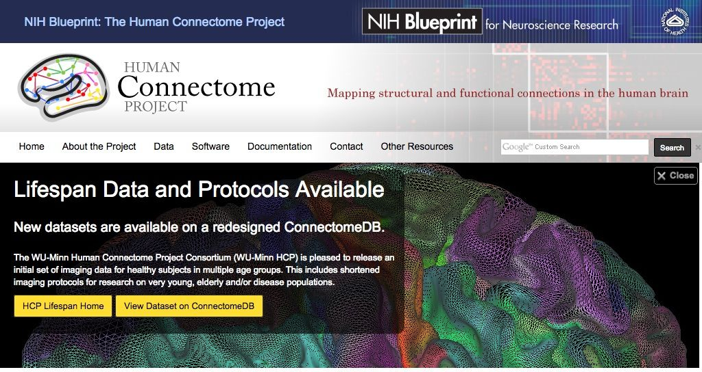
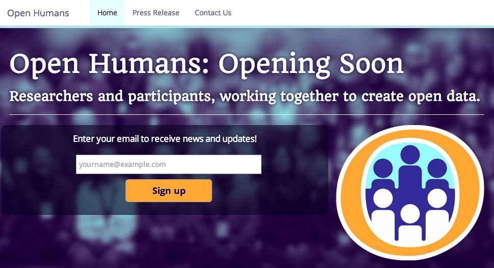
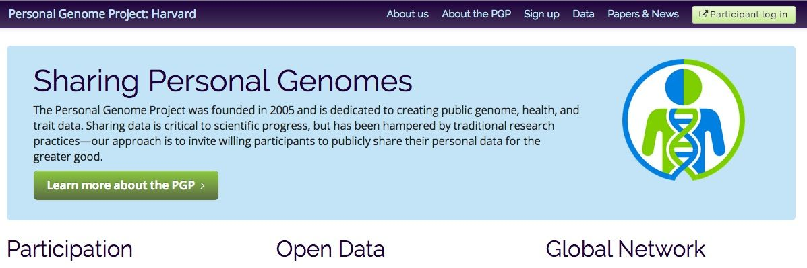

---

name: what-is
class: middle, center

# What is Databrary?

---

name: what-is-1
class: center

# Databrary is a digital *data library* specialized for storing and sharing 

---

name: what-is-2
class: center

# Databrary is a digital *data library* specialized for storing and sharing 

## video

---

name: what-is-3
class: center

# Databrary is a digital *data library* specialized for storing and sharing 

## video

## flat-file data

## and metadata.

---

name: video-is-special
class: middle, center

# Video can be readily repurposed for new uses with minimal metadata

---

name: repurposing-example-1
class: middle, center
<a href="https://nyu.databrary.org/volume/9">
  
</a>

---

name: video-needs-tags
class: middle, center

# Repurposing faster, more efficient with metadata tags

---

name: tagging-tools
class: middle, center

# Tools for manual metadata tagging

### [Transana](http://www.transana.org)


### [Elan](http://tla.mpi.nl/tools/tla-tools/elan/)


---

name: tagging-tools
class: middle, center

# Tools for manual metadata tagging

### [Noldus Observer](http://www.noldus.com/human-behavior-research/products/the-observer-xt)


### [Mangold Interact](http://www.mangold-international.com/software/interact/)


---

name: tagging-tools-commercial
class: middle, center

# Tools for manual metadata tagging

### [Datavyu.org](http://datavyu.org/user-guide/guide.html)


---

name: challenges
class: middle, center

# The Challenges of Open (Video) Data Sharing

---

name: challenges-1
class: middle, center

# Recordings are [identifiable](http://www.research.ucsf.edu/chr/HIPAA/chrHIPAAphi.asp). 
### How to preserve privacy but enable sharing?

---

name: challenges-2
class: middle, center

# Recordings are temporally dense; files are large. 
### How to store?

---

name: challenges-3
class: middle, center

# Sharing data not part of scientific workflow. 
### How to make attractive?

---

name: challenges-4
class: middle, center

# Data formats differ, may be incompatible
### Encourage flexible, universal data formats

---

name: overcoming
class: middle, center

# Overcoming the Challenges

---

name: preserving-privacy
class: middle, center

# Secure *consent to share*
## Build on informed consent, video/photo releases.

<a href="http://databrary.org/access/policies/release-template.html">
    
</a>

---

name: authorization
class: middle, center

# Access limited to [authorized researchers](https://nyu.databrary.org/)
## Promise to maintain confidentiality, protect data.
## [Institutional sign-off](https://databrary.org/access.html).

---

class: middle, center

<a href="http://humanconnectome.org/">
    
</a>

---

class: middle, center

<a href="http://http://openhumans.org/">
    
</a>

---

class: middle, center

<a href="http://www.personalgenomes.org/">
    
</a>

---

name: upload-as-you-go
class: middle, center

# Making data management/curation part of the workflow

--

## Upload as-you-go or active curation

--

### [Open Science Framework (OSF)](http://osf.io)

---

name: upload-demo
class: middle, center

<a href="https://nyu.databrary.org/volume/73">
  
</a>

---

name: manifesto
class: center, middle

# [Databrary Data Sharing Manifesto](https://databrary.org/access/policies/data-sharing-manifesto.html)

---
name: philosophy
class: center

# Share what you want (and have permission to share)
### Nothing, displays/tasks, flat file data, raw data

--
# Share when you want
### After a grant, after publication, as you go

--

# Share with whom you want
### Lab only, selected colleagues, Databrary community, public

---

name: future
class: middle, center

# The Future of Open Developmental Science

--

## Seamless data management

--

## Getting data in

--

## Getting data out

--

## Linking old and new data

--

## Deploying richer analyses

---

name: data-in
class: middle, center

# Getting data in
### More types of data

--

#### Physiology (EEG, heart rate, GSR)
#### EMA

--

### Automated tagging

---

name: automated-tagging
class: middle, center


#### <http://www.nytimes.com/2014/11/18/science/researchers-announce-breakthrough-in-content-recognition-software.html?_r=0>

---

name: data-out
class: middle, center

# Getting data out

--

### APIs

--

### Data URIs

```r
df.gilmore.14 <- read.csv("https://databrary.org/volume/73/slot/6490?...")
```

[https://nyu.databrary.org/volume/73/slot/6490?segment=-&select=&asset=13240](https://nyu.databrary.org/volume/73/slot/6490?segment=-&select=&asset=13240)

[Adamiak Thesis Analysis 2014-12-06 in RMarkdown](moco-adult-laminar-radial-summary.html)

--

### Linking metadata

---

name: data-linking
class: middle, center

# Linking datasets

--

### Macro

--

### Micro

--

### What metadata will facilitate linkage?

--

#### How to maintain privacy?

--

### Data provenance?

---
name: richer-analyses
class: middle, center

# Richer analyses

--

## Exploiting temporally rich data

--
## Exploiting spatially diverse (multilevel) data

---

name: data-science
class: middle, center

## Exploiting Advances in Data Science


#### <http://www.datasciencecentral.com/profiles/blogs/data-science-without-statistics-is-possible-even-desirable>

---

name: automatic-statistician
class: center
# [The Automatic Statistician](http://www.automaticstatistician.com/examples.php)


---

name: nsf
class: middle, center

<a href="http://www.nsf.gov/pubs/2015/nsf15523/nsf15523.htm">
  
</a>
#### <http://www.nsf.gov/pubs/2015/nsf15523/nsf15523.htm>

---

name: dougherty-03
class: middle, center


*http://www.journalofvision.org/content/3/10/1/F1.medium.gif*

### [Dougherty et al. 03](http://www.journalofvision.org/content/3/10/1.full)

---

name: fmri-setup
class: center, midddle

## Typical fMRI set-up


*http://openi.nlm.nih.gov/imgs/512/175/2747426/2747426_IJRI-18-210-g004.png*

---

name: block-design
class: middle, center

## Block designs


*http://www.sbirc.ed.ac.uk/cyril/gfx/fmri/design1.jpg*

---

name: hrf
class: middle, center

## Regional blood flow responds slowly to stimulus event

--

### Hemodynamic Response Function (HRF)

--

#### 3-6s rise


*http://www.sbirc.ed.ac.uk/cyril/gfx/fmri/design2.jpg*
