name: title-slide
class: center, middle

# Prepare to Share: Organizing Your Research Data
## With

## [databrary.org](http://databrary.org)

### [Rick O. Gilmore](http://www.personal.psu.edu/rog1)
### 2015-02-25

---

name: agenda-1
class: center

# Agenda

--

### [What is Databrary?](#what-is)

--

### [Video is special](#video-is-special)

--

### [The Challenges of Open (Video) Data Sharing](#challenges)

--

### [Overcoming the Challenges](#overcoming)

--

### [Why You Should Share](#why-share)

--

### Keep in touch!

---

name: what-is
class: middle, center

# What is Databrary?

---
name: what-is-0
class: middle, center

<a href="http://databrary.org">
    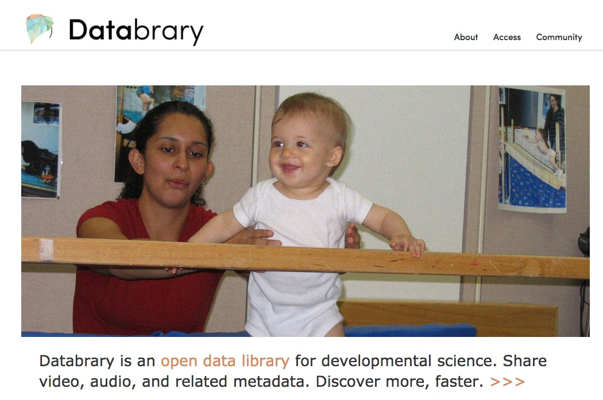
</a>
### <http://databrary.org>

---

name: what-is-1
class: center

# Databrary is a web-based *data library* specialized for storing and sharing 

--

## video

--

## flat-file data

## and metadata

---

name: what-is-2
class: center

# Databrary is 

## built by and for developmental scientists

--

## but, we're not restricted to developmental research

---

name: databrary-team
class: center

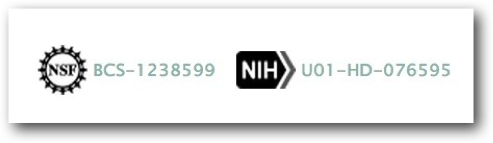

--

#### Karen Adolph & David Millman

--

#### Dylan Simon & Lisa Steiger

---

name: video-is-special
class: center

# Video... 

## is special.

--

## uniquely captures the complexity and richness of behavior

--

## can be readily repurposed for new uses with minimal metadata

--

## poses special, **but solveable** problems concerning consent

---

name: challenges
class: center

# The Challenges of Open (Video) Data Sharing

--

## Recordings are [identifiable](http://www.research.ucsf.edu/chr/HIPAA/chrHIPAAphi.asp) 
### How to preserve privacy but enable sharing?

--

## Recordings are temporally dense; files are large 
### Where/how to store for sharing?

---

name: challenges-2
class: center

# The Challenges of Open (Video) Data Sharing

--

## Coded data formats differ, may be incompatible
### Mangold vs. Noldus vs. Transana vs. Datavyu vs. Studiocode vs. NVivo

--

## Sharing data not part of scientific workflow
### Make data curation/management for sharing "invisible"

---

name: overcoming
class: middle, center

# Overcoming the Challenges

---

name: not-youtube
class: middle, center

--

---

name: preserving-privacy
class: center

# *Recordings are identifiable, so we must...*

--

## Secure *consent to share*
## Build on informed consent, video/photo releases.

---

name: release-template
class: middle, center

<a href="http://databrary.org/access/policies/release-template.html">
    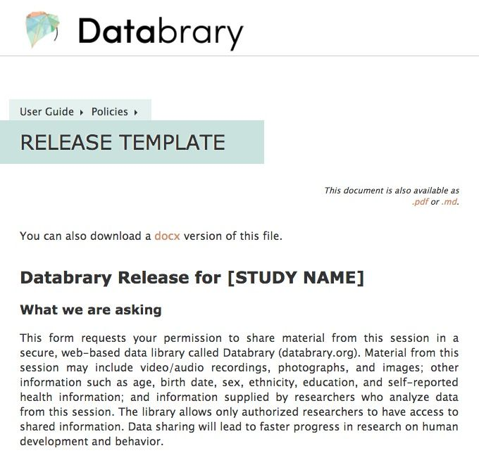
</a>
### <http://databrary.org/access/policies/release-template.html>

---

name: permission-to-share-details
class: middle, center

# *Do you give permission for your identifiable or sensitive information to be shared with* **other researchers**?
### <http://databrary.org/access/policies/release-template.html>

---

name: permission-to-share-video
class: middle, center

<iframe width="854" height="510" src="//databrary.org/video/example-video-2.mp4" frameborder="1" allowfullscreen></iframe>
### <http://databrary.org/video/example-video-2.mp4>

---

name: authorization
class: middle, center

# Qualifications for [authorized researchers](https://nyu.databrary.org/)

<a href="http://databrary.org/access.html">
    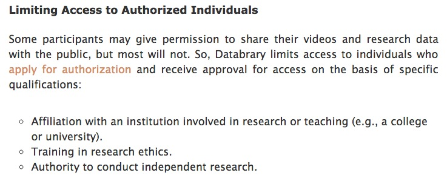
</a>
### <http://databrary.org/access.html>

---

name: three-principles
class: middle, center

# Authorized researchers promise to maintain confidentiality, protect data.
<a href="http://databrary.org/access.html">
    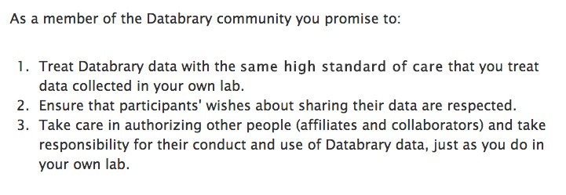
</a>
### <http://databrary.org/access.html>

---

name: institutional-signoff
class: middle, center

# [Institutions must sign-off](https://databrary.org/access.html).
<a href="http://http://databrary.org/access/guide/institutions.html" >
    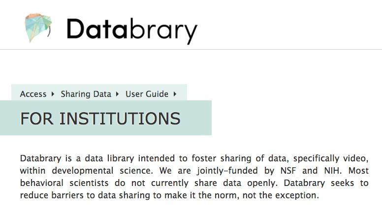
</a>
### <http://http://databrary.org/access/guide/institutions.html>

---

name: files-are-big
class: center

# *Recordings are large and come in varied file formats, so we must...*

## Store centrally
## Digitize, convert to standard formats, 
## Convert automatically, not burden researchers.

---

name: incentives
class: middle, center

# There are **few** incentives for data-sharing...

---

name: upload-as-you-go
class: center
# So, we must

## Make data management/curation part of the workflow

--

## Upload as-you-go or active curation

--

### [Open Science Framework (OSF)](http://osf.io)

---

name: upload-demo
class: middle, center

<a href="https://nyu.databrary.org/volume/73">
  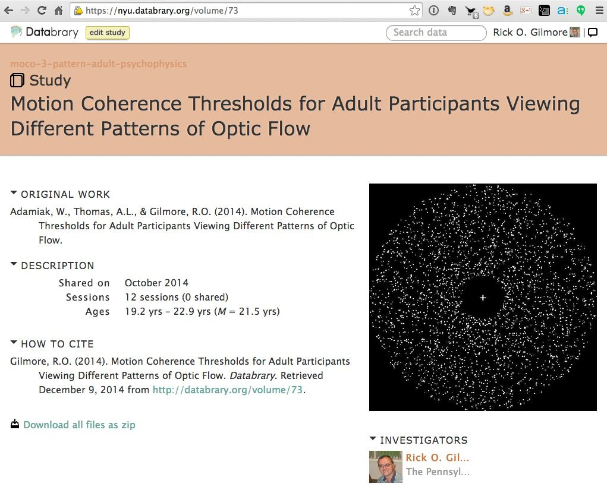
</a>

---

name: manifesto
class: center, middle

# Create positive peer support, not pressure, for sharing
## [Databrary Data Sharing Manifesto](https://databrary.org/access/policies/data-sharing-manifesto.html)

---

name: philosophy
class: center

# Share what you want (and have permission to share)
### Nothing, displays/tasks, flat file data, raw data

--
# Share when you want
### After a grant, after publication, as you go

--

# Share with whom you want
### Lab only, selected colleagues, Databrary community, public

---

name: why-share
class: middle, center

# Why You Should Share

---

name: save-time-money
class: middle, center

# Save time, money

### <http://lowres.jantoo.com/business-desk_job-filing_cabinet-cleaning-cleaners-office_job-16437782_low.jpg>

---

name: get-grants
class: middle, center

# Improve chances at funding
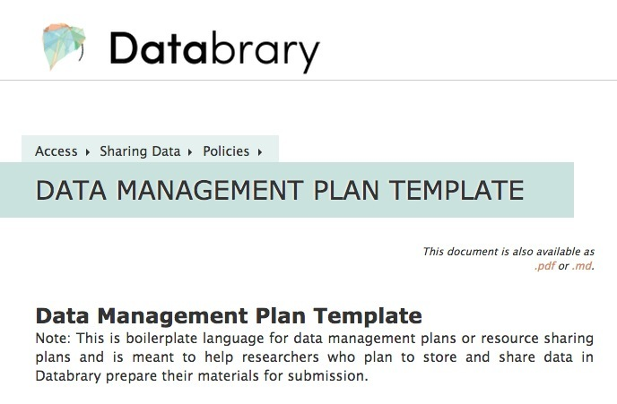
### <http://databrary.org/access/policies/dmp-template.html>

---

name: cool-people
class: middle, center

# Cool people are doing it

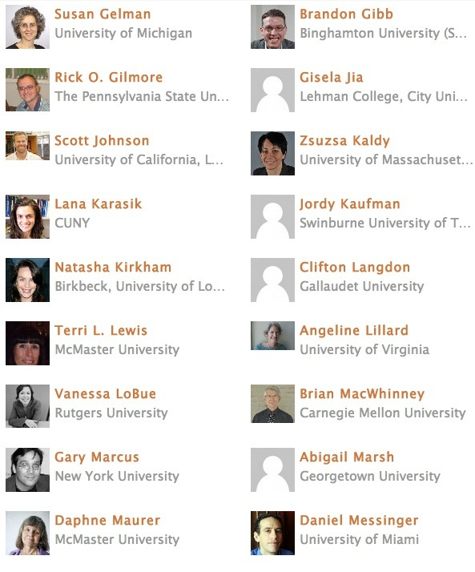
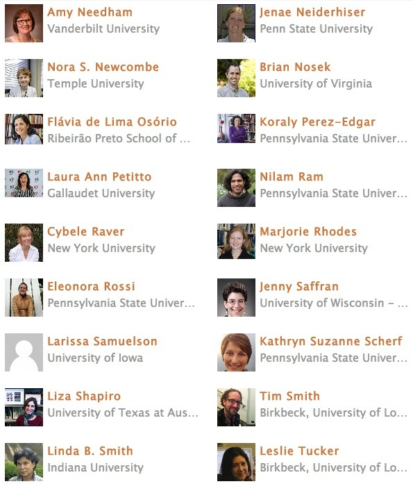

---

name: use-cases
class: middle, center

# There are so many ways to use it

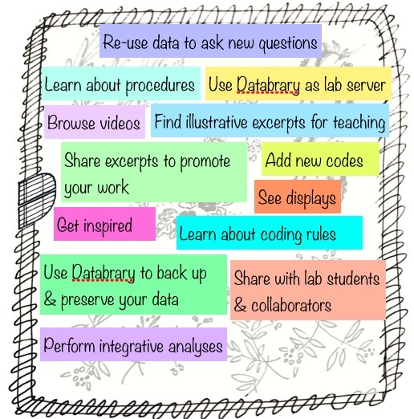

---

name: teaching-use-cases
class: middle, center

# Teaching

## Libertus & Needham et al. 2010
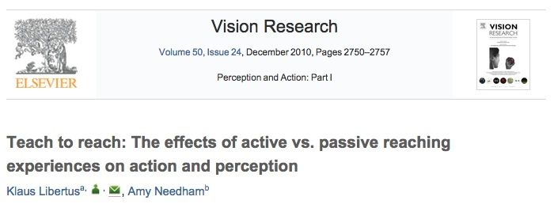

### <https://nyu.databrary.org/volume/64>

---

name: libertus-needham-2010
class: center

<iframe width="1000" height="600" src="//nyu.databrary.org/volume/64/" frameborder="1" allowfullscreen></iframe>

---

name: data-model
class: middle, center

# Organize data **your** way, but make it discoverable by others

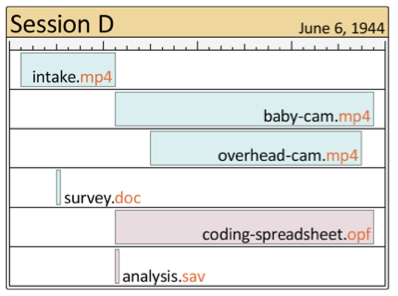

---

name: sessions
class: center

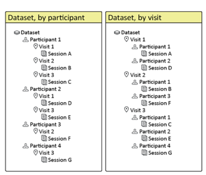
--
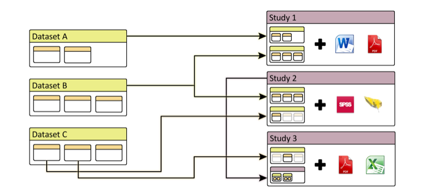

---

name: lets-prepare-to-share
class: middle, center

# Let's Prepare to Share
## With

## [databrary.org](http://databrary.org)

---

name: next-steps
class: center

# Next steps

### Create an account, apply for authorization

<http://databrary.org/register>

--

### Think about what materials you can share right away

#### Clips for teaching?

--

### Apply for IRB permission to share identifiable data in the future

### Or, ask the IRB whether your current audio/video consent is "Databrary-compatible"

---

name: agenda-1
class: center

# Agenda

--

### [What is Databrary?](#what-is)

--

### [Video is special](#video-is-special)

--

### [The Challenges of Open (Video) Data Sharing](#challenges)

--

### [Overcoming the Challenges](#overcoming)

--

### [Why You Should Share](#why-share)

---

name: keep-in-touch
class: middle, center

# Keep in touch!
### Databrary digital library: <http://databrary.org>
### Datavyu video coding tool: <http://datavyu.org>
### This talk: <http://gilmore-lab.github.io/talks/2015-02-23-hdfs/>
### SRCD 2015 Booth
### SRCD Preconference Workshop "Coding and Sharing Video Data with Datavyu and Databrary", March 18, 2015: <http://databrary.org/post/pre-conference.html>
### rogilmore@psu.edu, rick@databrary.org

