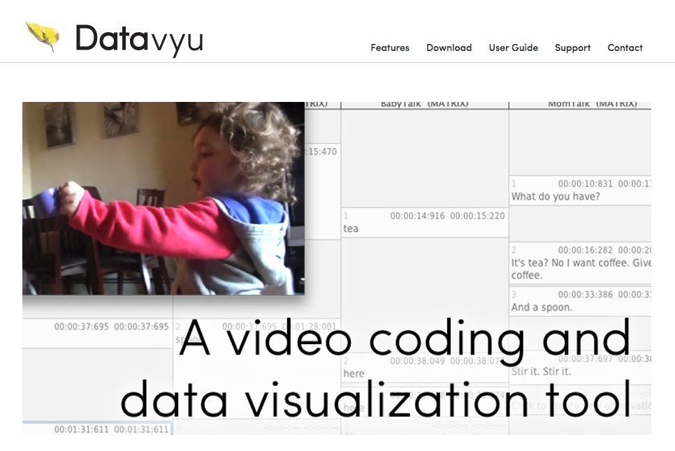

---

name: keep-in-touch
class: center, middle

# <http://gilmore-lab.github.io>
# <http://gilmore-lab.github.io/talks/2015-01-23-csc>
### View this talk
# <https://github.com/gilmore-lab/talks/tree/gh-pages/2015-01-23-csc>
### Download talk files
# <http://databrary.org>
## Databrary @ SRCD March 25-28, 2014

---

name: metadata-is
class: center, middle

<a href="http://26.media.tumblr.com/tumblr_ls8sjtJjOi1qz6f4bo1_500.jpg">
    
</a>
### <http://26.media.tumblr.com/tumblr_ls8sjtJjOi1qz6f4bo1_500.jpg>

---

name: funniest-videos
class: center, middle

<iframe width="492" height="277" src="//www.youtube.com/embed/NpLrfGo02aM" frameborder="0" allowfullscreen></iframe>
### <http://www.youtube.com/embed/NpLrfGo02aM>

---

name: repurposing-example-1
class: middle, center
<a href="https://nyu.databrary.org/volume/9">
  
</a>
### <https://databrary.org/volume/9>

---

name: adolph-databrary-vol-9
class: middle, center

<iframe width="1000" height="600" src="//nyu.databrary.org/volume/9/" frameborder="1" allowfullscreen></iframe>

---

name: video-needs-tags
class: middle, center

# Repurposing is faster, more efficient with metadata tags
### age, sex, indoor/outdoor, task, etc.

---

name: tagging-tools-academic-1
class: middle, center

# Tools for manual metadata tagging

### [Transana](http://www.transana.org)


### [Elan](http://tla.mpi.nl/tools/tla-tools/elan/)


---

name: tagging-tools-commercial-1
class: middle, center

# Tools for manual metadata tagging

### [Noldus Observer](http://www.noldus.com/human-behavior-research/products/the-observer-xt)


### [Mangold Interact](http://www.mangold-international.com/software/interact/)


---

name: tagging-tools-commercial-2
class: middle, center

# Tools for manual metadata tagging

### [Studiocode](http://www.studiocodegroup.com)


---

name: tagging-tools-academic-2
class: middle, center

# Tools for manual metadata tagging

### [Datavyu.org](http://datavyu.org/user-guide/guide.html)


---

name: data-sharing-video
class: middle, center

<iframe width="854" height="510" src="//www.youtube.com/embed/N2zK3sAtr-4" frameborder="1" allowfullscreen></iframe>
### <http://www.youtube.com/embed/N2zK3sAtr-4>

---

name: future
class: center

# The Future of Open Developmental Science

--

## [Web-based video tagging/coding](#datavyu-2.0)

--

## [Seamless data management](#seamless-data-management)

--

## [Getting data in](#data-in)

--

## [Getting data out](#data-out)

--

## [Linking old and new data](#data-linking)

---

name: future-2
class: center

# The Future of Open Developmental Science

## [Graduate Training](#grad-training)

--

## [Deploying richer analyses](#richer-analyses)

---

name: datavyu-2.0
class: center

# The future of video coding/tagging...

--

### Web-based coding

--

### Datavyu 2.0

--

### Integrate/synch multiple streams

--

### Export to preferred analysis formats

--

### Generate code books

---

name: seamless-data-management
class: center

# Research "Consoles"

--

### Keep ongoing record of all research-related work

--

### "Living" documents

--

### Version control

---

name: research-consoles
class: middle, center

### RStudio


### iPython Notebooks


---

name: research-consoles
class: middle, center

### [Open Science Framework (OSF)](http://osf.io) from the [Center for Open Science (COS)](http://centerforopenscience.org/)


---

name: sharing-references
class: middle, center

# Sharing references

### [Mendeley](http://www.mendeley.com/)
<a href="http://www.mendeley.com/">
  
</a>

### [Zotero](http://zotero.org)
<a href="http://zotero.org">
  
</a>

---

name: data-in
class: center

# Getting data in
### More types of data

--

#### Physiology (EEG, heart rate, GSR)


#### EMA


---

name: automated-tagging
class: center

# Getting data in
### Automated tagging


#### <http://www.nytimes.com/2014/11/18/science/researchers-announce-breakthrough-in-content-recognition-software.html?_r=0>

---

name: data-out
class: center

# Getting data out

--

### APIs

--

### Data URIs

```r
df.gilmore.14 <- read.csv("https://databrary.org/volume/73/slot/6490?...")
```

[https://nyu.databrary.org/volume/73/slot/6490?segment=-&select=&asset=13240](https://nyu.databrary.org/volume/73/slot/6490?segment=-&select=&asset=13240)

[Adamiak Thesis Analysis 2014-12-06 in RMarkdown](moco-adult-laminar-radial-summary.html)

---

name: data-linking-2
class: center

# Linking datasets

### Macro


---

name: data-linking-2
class: center

# Linking datasets

### Macro


---

name: data-linking-3
class: center

# Linking datasets

### Micro


---

name: data-linking-4
class: center

# What metadata will facilitate linkage?

--

### How to maintain privacy?

--

### Data provenance?

---

name: grad-training
class: center

# What do students need to know to thrive in a big-data, data science hungry world?

--

## Command line

--

## Version control (e.g., [GitHub](http://github.com))

--

## Programming (Javascript, HTML, CSS, Python, R)

--

## Databases (e.g., SQL and NoSQL)

---

name: software-carpentry
class: middle, center
<a href="http://software-carpentry.org">
  
</a>
### <http://software-carpentry.org>

---

name: open-science-framework
class: middle, center

<a href="http://osf.io">
  
</a>
### <http://osf.io>

<a href="http://centerforopenscience.org" height="200px">
  
</a>
### <http://centerforopenscience.org>

---

name: richer-analyses
class: middle, center

# Richer analyses

--

## Exploiting temporally rich data

--
## Exploiting spatially diverse (multilevel) data

---

name: data-science
class: middle, center

## Exploiting Advances in Data Science


#### <http://www.datasciencecentral.com/profiles/blogs/data-science-without-statistics-is-possible-even-desirable>

---

name: automatic-statistician
class: center
# [The Automatic Statistician](http://www.automaticstatistician.com/examples.php)


---

name: nsf
class: middle, center

<a href="http://www.nsf.gov/pubs/2015/nsf15523/nsf15523.htm">
  
</a>
#### <http://www.nsf.gov/pubs/2015/nsf15523/nsf15523.htm>

---
name: individual-autonomy
class: middle, center

# Reinforcing individual autonomy in big-data research

---

name: human-connectome
class: middle, center

<a href="http://humanconnectome.org/" >
    
</a>

---

name: open-humans
class: middle, center

<a href="http://http://openhumans.org/">
    
</a>

---

name: personal-genomes
class: middle, center

class: middle, center

<a href="http://www.personalgenomes.org/">
    
</a>

---

name: permission-to-share-video
class: middle, center

<iframe width="854" height="510" src="//databrary.org/video/example-video-2.mp4" frameborder="1" allowfullscreen></iframe>
### <http://databrary.org/video/example-video-2.mp4>

---

name: files-are-big
class: center

# *Recordings are large and come in varied file formats, so we must...*

## Store centrally
## Digitize, convert to standard formats, 
## Convert automatically, not burden researchers.

